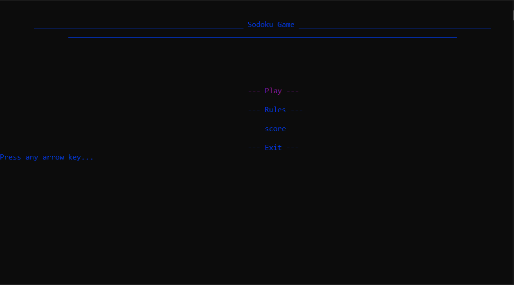
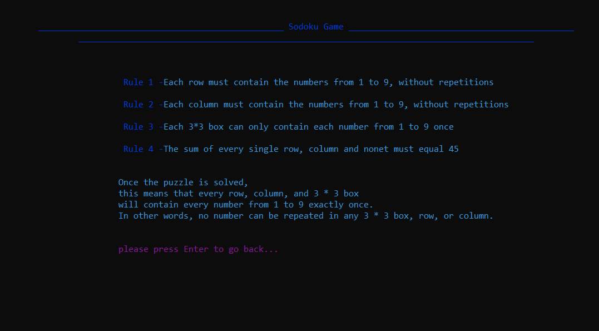
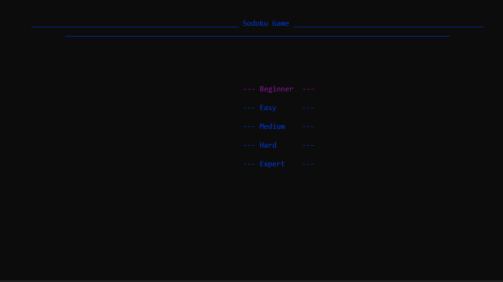
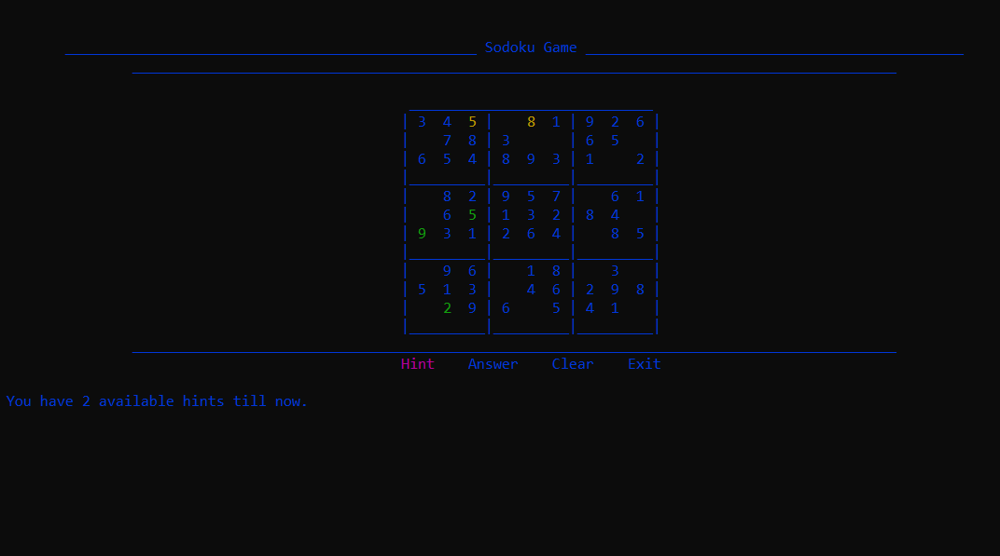
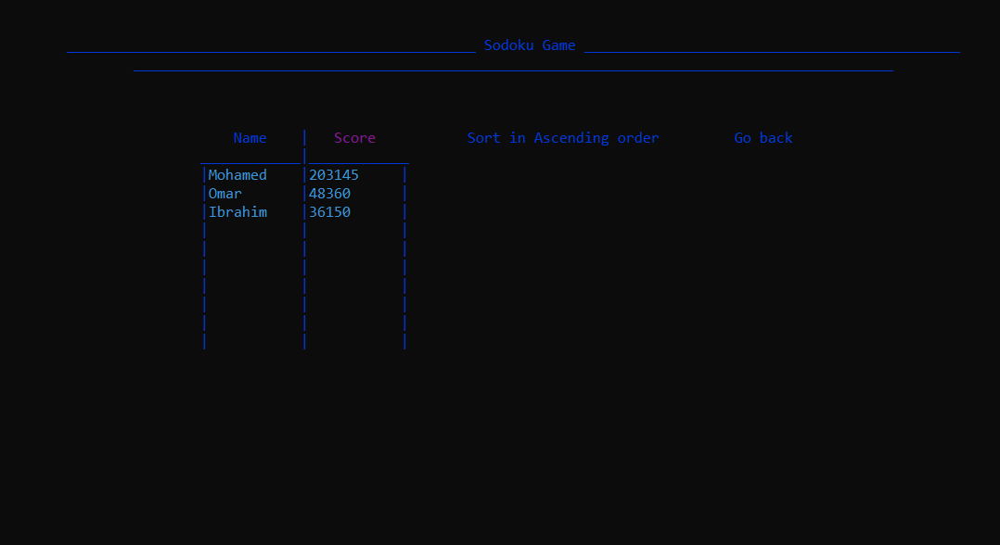

# Sudoku Game Project

## Overview
This is a terminal-based Sudoku game written in C. The game features different levels of difficulty, a rules screen, score tracking and sorting, hints, input validation, and more. You can navigate the game using arrow keys and input numbers from the keyboard.

## Features
- Play Sudoku in the terminal using arrow keys and keyboard input.
- Choose from various levels of difficulty: Beginner, Easy, Medium, Hard, Expert.
- Rules screen provides information on how to play the game.
- View, save, and sort scores in ascending/descending order by score or player name.
- Utilize hints to help solve the puzzle.
- Clear incorrect inputs to correct mistakes.
- Display the solution to the puzzle.

## Usage
1. Run the program in your terminal.
2. Navigate through the menu using arrow keys.
3. Choose a difficulty level.
4. Read the rules and instructions.
5. Play Sudoku by navigating the board with arrow keys and inputting numbers using the keyboard.
6. Use hints, clear inputs, and show answers as needed.
7. After completing the puzzle, enter your player name to save your score.

## Screenshots

## Gameplay Video
[Watch the gameplay video on Google Drive](https://drive.google.com/file/d/1MQBRPYFIiiZXkD3ey9BF_fw3kHgtbXly/view?usp=drive_link)

## How to Compile and Run
1. Ensure you have a C compiler installed (e.g., GCC).
2. Open a terminal and navigate to the project directory.
3. Compile the program using the command: `gcc sudoku.c -o sudoku`
4. Run the compiled program: `./sudoku`

## Dependencies
- C compiler (e.g., GCC)
